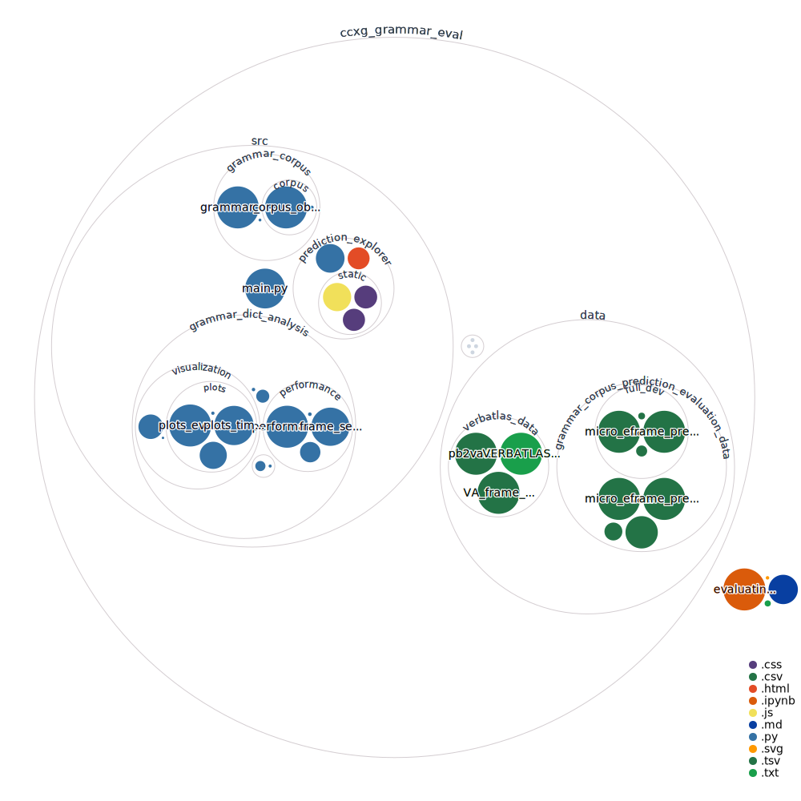

# Evaluating Large-Scale Construction Grammars on Semantic Frame Extraction

This repository is part of a thesis project that involved the evaluation of large-scale, broad-coverage computational construction grammars with respect to their capability to extract semantic roles and frames from raw, unannotated English sentences. The study was performed as part of the [SemBrowse](https://ehai.ai.vub.ac.be/sembrowse/) (EHAI, 2023) project—an innovative corpus-linguistic tool developed by researchers from the Vrije Universiteit Brussel (VUB) and the Université de Namur (UNamur). SemBrowse serves as a discovery engine, able to identify attestations of frame-semantic patterns within text corpora based on the frame specification alone. At its core, SemBrowse leverages Fluid Construction Grammar ([FCG](https://www.fcg-net.org/)) (Beuls & Van Eecke, 2023; Steels, 2011a, 2017) and employs the PropBank (Palmer et al., 2005; Pradhan et al., 2022) rolesets to symbolize frames. These semantic frames capture an event with its participants, also known as an argument structure.

This repository contains the code and resources for the project. It is meant as a supplement to the main body of text, and serves mainly as a technical documentation of the evaluation process. It contains all the source code used to evaluate the frame predictions of large-scale construction grammars. The main info is summarized here. The other documentation can be found in the [Jupyter notebook](https://github.com/TomMoeras/evaluating-large-scale-construction-grammar/blob/main/evaluating_ccxg_grammars.ipynb) in the main directory.

## File Structure

The repository holds one main folder. The entire content can be [explored here](https://mango-dune-07a8b7110.1.azurestaticapps.net/?repo=TomMoeras%2Fevaluating-large-scale-construction-grammar-clin).

* **ccxg_grammar_eval**

  * This folder contains the data, objects and source code used to evaluate the grammars' performance.

### CCxG Grammar Eval Folder



#### Data Folder

The data folder contains the "grammar_corpus_prediction_evaluation_data" and the "verbatlas_data". The files in the "grammar_corpus_prediction_evaluation_data" are the raw .csv files containing the data used to make the grammar_dict object which houses all the performance info of the grammars.

#### Grammar_Dict_Pickle Folder

The "grammar_dict_pickle" folder contains the pickle files that were generated from the .csv files in the "data" folder. These objects are directly used in the Quarto documents to generate the tables and figures.

#### Src Folder

The "src" folder contains the source code used for:

1. Generate the grammar objects which house all the information containing the grammar's performance on the corpus. (=> "grammar_corpus" & "main.py")
2. Analyze the contents of these objects to gather meaningful insights. (=> "grammar_dict_analysis")
3. Visualizing the grammars' predictions, facilitating comparing their results. (=> "prediction_explorer")

## Replicating the Results

The study's results can be replicated in a couple of different ways. They all require the installation of the packages in requirements.txt.

```
pip install -r requirements.txt
```

* Using the Jupyter notebook file, which contains the main functions used in the study and an explanation to how they function. These use the pickle objects used in the study itself.
* Re-creating the pickle objects by using the "main.py" file. Note that this is not possible without using the "corpus_data.csv" which is not provided in this repository due to licensing restrictions. This file is available on request.

Note that the pickle objects containing all the data used for this study are stored using git lfs. It could be that you need to install/pull these separately:

```
brew install git-lfs # use the right command on your system
git lfs install
git lfs pull
```

## The Grammar Prediction Explorer

The Grammar Predictions Explorer is a simple web-based tool specifically designed to visualize and compare grammar predictions. Its features help to simplify the exploration of predictions made by various, different grammars. It uses the pickle objects from the "grammar_dict_pickle" folder.

The current features of the Grammar Predictions Explorer include:

- Sentence Search: The application allows the user to search for a specific sentence based on either the sentence string or the sentence ID. This feature helps in locating particular sentences with ease and efficiency.
- F1 Scores Display: The tool provides a visual display of the F1 scores for different grammars, allowing the user to compare their performances. The scores can be viewed either in a plot format or via a dropdown menu.
- Comprehension Time: The Grammar Predictions Explorer also displays the time each grammar took to comprehend the sentences, providing insight into the efficiency of each grammar. This data is represented in a plot format.
- Prediction Visualization: The tool allows the user to select a specific grammar and visualize its prediction in two formats - as a table and using labels on the sentence string. This feature helps the user to quickly identify the differences between the predictions made by different grammars and the gold standard annotations.
- Composite Performance Scores: The Grammar Predictions Explorer provides the Compositive Performance Score table for an indvidual, giving the user an immediate idea of how different grammars performed on a specific sentence.
- Micro Evaluation Info: The tool also offers micro evaluation information, providing basic statistics about each sentence, such as the number of tokens, frames, roles, and more.

All examples discussed in this study, as well as the corresponding visualizations, were generated using the Grammar Predictions Explorer, exemplifying its utility for the evaluation of the different grammars.

### Running the Grammar Prediction Explorer

Using this tool can be done by running the "app.py" file and opening the webpage on localhost (Chrome as browser is preferable).
